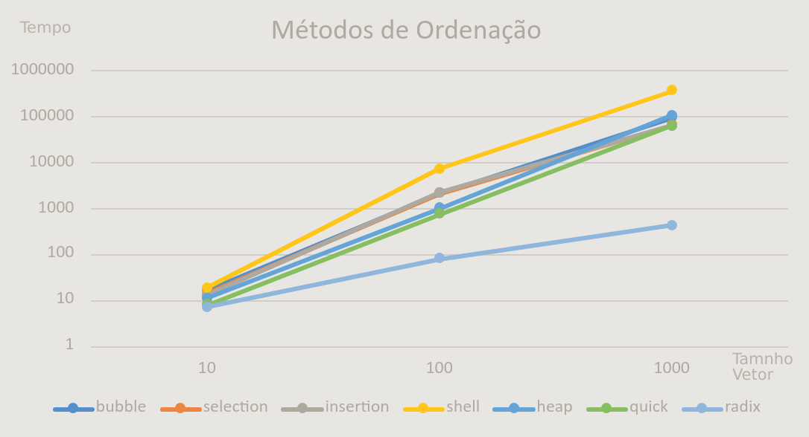

# Algoritmos e Estruturas de Dados
## Terceira Etapa do Algoritmo de Recomendacao(LRU)
Lucas Martins Soares

## Relatório do gráfico da medida de tempo dos metodos de ordenação:

Foram testados 7 metodos de ordenação:

### Quadraticos:
  1. bubble
  1. selection
  1. insertion
  1. shell.

### Logarítmicos:
  1. heap
  1. quick
  1. radix

Todos os métodos de ordenação foram testados uma vez para vetores de tamanho de 10, 100 e 1000 posições. Não foi possível comparar além de 1000 posições pois alguns métodos demoraram muito para executar e geraram arquivos enormes.
O método MergeSort não entrou na estatística pois apresentou um erro no malloc para vetores maiores que 10 posições.

## Código

O tempo total de execução de cada método foi obtido da seguinte forma:

```C++
#include "time.h"

  inicio = clock();
  metodoDeOrdenacao(&v, *tamanhoArray);
  fim = clock();

  tempoTotal =
        ((float)fim - (float)inicio);
  printf("tempoTotal: %f\n", tempoTotal);
```

## Tabela

Abaixo seguem os valores obtidos para cada para cada método e para cada tamanho do vetor:

| tamanho | bubble	| selection	| insertion	| shell	 | heap	  | quick	| radix |
|---------|---------|-----------|-----------|--------|--------|-------|-------|
|10	      | 17	    | 14	      | 13	      | 19	   | 11	    | 8	    | 7
|100      | 2146	  | 2171	    | 2210	    | 7330	 | 1032	  | 744	  | 81
|1000     | 95476	  | 65755	    | 65149	    | 366352 | 108048	| 64395	| 427

## Gráfico

Abaixo segue o gráfico gerado com os valores obtidos:



